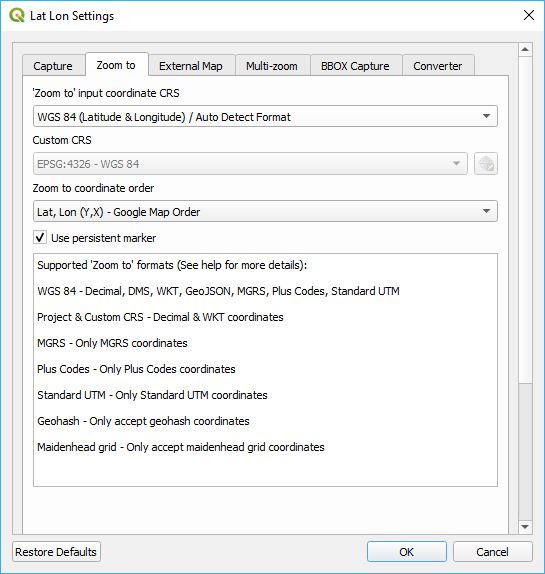
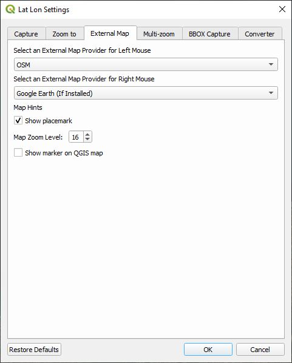

# Lat Lon Tools Plugin

***Lat Lon Tools*** is a suite of tools that makes it easy to interact with other on-line mapping tools. When working with **Google Earth**, **Google Maps** or other on-line mapping tools, coordinates are usually specified in the order of 'Latitude, Longitude', but the similar existing QGIS plugins specify the coordinates in the reverse order or require separate fields for latitude and longitude. This makes it so that you have to copy and paste each piece of the coordinate between QGIS and Google Maps which is time consuming. This plugin fixes this problem and adds additional functionality. By default ***Lat Lon Tools*** snapshots coordinates and parses them in the order of "Latitude, Longitude," but the user can configure this in **Settings** to reverse to the order to "Longitude, Latitude." ***Lat Lon Tools*** has four tools.

*  ***Copy Latitude, Longitude*** - This captures coordinates onto the clipboard when the user clicks on the map using the standard Google Map format or a format specified in ***Settings***. If the user specifies a **Tab** separator, then the coordinate can be pasted into a spreadsheet in separate columns. While this tool is selected, the coordinate the mouse is over is shown in the lower left-hand corner either in **decimal degrees**, **DMS**, or **MGRS** depending on the **Settings**.
*  ***Show in External Map*** - With this tool, the user can click on the QGIS map which launchs an external browser and displays the location on an external map. Currently Open Street Map, Google Maps, and Bing Maps are supported. The desired map can be configured in **Settings**.
*  ***Zoom to Latitude, Longitude*** - With this tool, type or paste a coordinate into the text area and hit **Enter**. QGIS will then center the map on the coordinate, highlight the location and create a temporary marker at the location. The marker can be removed with the  button. The coordinate format can either be **DMS**, **decimal degrees**, or **MGRS**. The ***Coordinate Order*** in ***Settings*** dictates whether the order is latitude followed by longitude or longitude followed by latitude. By default the order is "Latitude, Longitude", the format used by Google Maps. Pressing the  also causes QGIS to zoom to that location.

* ***Multi-location Zoom*** - With this tool the user can read in a set of coordinates that are in either **decimal degrees** or **DMS** notation. The one requirement is that each pair of coordinates are on separate lines and in the order is latitude followed by longitude. The user can also paste or type in a coordinate in the ***Add Single Coordinate*** box and add it to the list. When the user clicks on one of the coordinates in the list, the QGIS map will center itself and highlight the coordinate.

By default ***Lat Lon Tools*** follows the **Google Map** convention making it possible to copy and paste between QGIS, Google Map, Google Earth, and other on-line maps without breaking the coordinates into pieces. All tools work with latitude and longitude coordinates regardless of the QGIS project coordinate reference system. In ***Settings*** the user can choose the ***Coordinate Capture Delimiter*** used between coordinates with presets for **Comma**, **Space**, and **Tab**. **Other** allows the user to specify a delimited string which can be more than one character. The user can also choose whether the snapshot format is in **Decimal Degrees**, **DMS coordinates**, **Native CRS coordinates**, or **MGRS coordinates**.

## Settings

### Capture & Display Settings

There are 5 capture formats that can be selected from the ***Select the Coordinate Capture Format*** drop down menu. The formats of each are as follows.

* **Decimal Degrees** - "42.20391297, -86.023854202"
* **DMS** - "36&deg; 47' 24.27" N, 99&deg; 22' 9.39" W"
* **DDMMSS** - "400210.53N, 1050824.96 W"
* **Native CRS** - This captures the coordinates in the Native CRS
* **MGRS** - This captures the coordinates in the [MGRS](https://en.wikipedia.org/wiki/Military_grid_reference_system) format

Note that in the DMS formats, the number of digits after the decimal is set by ***DMS Second Precision***. The ***Coordinate Capture Delimiter*** is what separates the two coordinates. In the drop down menu you can specify a **Comma** which is really a comma followed by a space. Additional delimiters are **Tab**, **Space**, and **Other**. If **Other** is selected, then the contents of ***Other Delimiter*** will be used.

The order in which the coordinates are captured are determined by ***Coordinate Capture Order*** and are one of the following.

* **Lat, Lon (Y,X) - Google Map Order**
* **Lon, Lat (X,Y) Order**.

### Zoom to Settings

The ***Zoom to Latitude, Longitude*** tool accepts the following input coordinates as specified by ***Zoom to Coordinate Type***:

* **WGS 84 (Latitude & Longitude)** - Input coordinates can be either in decimal or DMS degrees. The order of the coordinates are determined by ***Zoom to Coordinate Order***.
* **MGRS** - This accepts [MGRS](https://en.wikipedia.org/wiki/Military_grid_reference_system) coordinates as input.

The order in which the coordinates are parsed in the ***Zoom to Latitude, Longitude*** tool is specified by ***Zoom to Coordinate Type*** and has the following two options:

* **Lat, Lon (Y,X) - Google Map Order**
* **Lon, Lat (X,Y) Order**

### External Map Settings

Here you can ***Select an External Map Provider***. The options are:

* **OSM** - Open Street Map
* **Google Map**
* **Google Aerial**
* **Bing Map**
* **Bing Aerial**

***Map Hints*** are desired attributes you would like to see in the resulting map. 

* **Show placemap** - When checked the external map will show a placemark at the location clicked on in the QGIS map. If this is not checked then the external map will center itself around clicked location, but will not display the placemark.
* **Map Zoom Level** - This is the desired default zoom level in the external map when it is launched.
