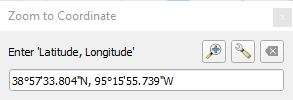
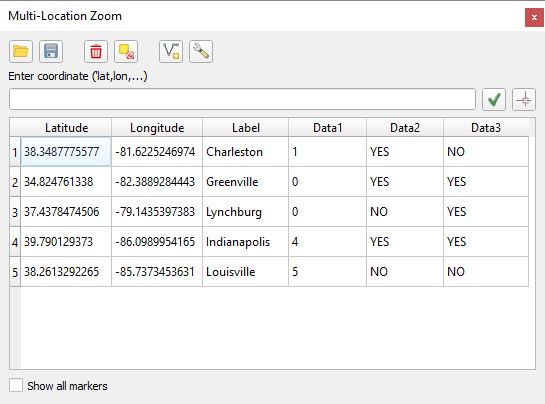
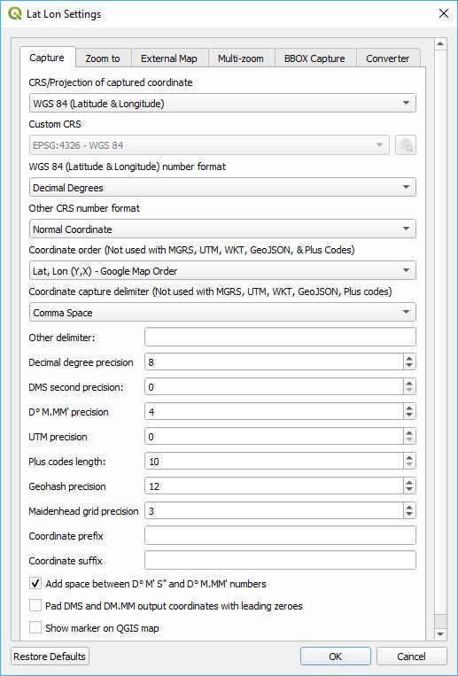

# Lat Lon Tools Plugin

When working with Google Earth, Google Maps or other on-line mapping tools coordinates are specified in the order of 'Latitude, Longitude', but the similar existing QGIS plugins specify the coordinates in the reverse order or require separate fields for latitude and longitude. This makes it so that you cannot just copy and paste between QGIS and Google Maps. This plugin fixes this problem and adds some additional functionality. Lat Lon Tools has three tools.

* **Copy Latitude, Longitude** - This captures coordinates onto the clipboard when the user clicks on the map using the standard Google Map format or a format specified in *Settings*. If the user specifies a tab separator, then the coordinate can be pasted into a spreadsheet in separate columns. While this tool is selected, the coordinate the mouse is over is shown in the lower left-hand corner either in decimal degrees or DMS depending on the *Settings*.
* **Zoom to Latitude, Longitude** - With this tool, type or paste a coordinate into the text area and hit *Enter*. QGIS will then center the map on the coordinate and highlight the location. The format can either be DMS or in decimal degrees, but latitude must be first followed by longitude. 

* **Multi-location Zoom** - With this tool the user can read in a set of coordinates that are in either decimal degrees or DMS notation. The one requirement is that each pair of coordinates are on separate lines and in the order of latitude followed by longitude. The user can also paste or type in a coordinate in the *Add Single Coordinate* box and add it to the list. When the user clicks on one of the coordinates in the list, the QGIS map will center itself highlight the coordinate.

Because Lat Lon Tools follow the Google Map convention, it makes it possible to copy and paste between QGIS, Google Map, Google Earth, and other on-line maps. All tools work with latitude and longitude coordinates regardless of the QGIS project coordinate reference system. In the settings the user can choose the delimiter used between coordinates with presets for comma, space, and tab. *Other* allows the user to specify a delimited string which can be more than one character. The user can also choose whether the output format is in decimal degrees, DMS coordinates or in the native CRS.

## Settings
This shows the settings dialog box.

There are 4 capture formats that can be selected from the drop down menu. The formats of each are as follows.

* **Decimal Degrees** - "42.20391297, -86.023854202"
* **DMS** - "36&deg; 47' 24.27" N, 99&deg; 22' 9.39" W"
* **DDMMSS** - "400210.53N, 1050824.96 W"
* **Native CRS** - This captures the coordinates in the Native CRS

Note that in the DMS formats, the number of digits after the decimal is set by **DMS Second Precision**. The Delimiter is what separates the two coordinates. In the drop down menu you can specify a comma which is really a comma followed by a space. Additional delimiters are a tab, space, and other. If **Other** is selected, then the contents of **Other Delimiter** will be used.
